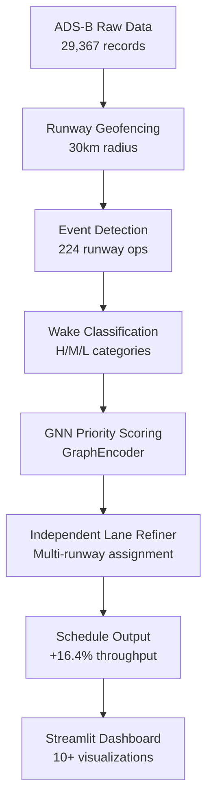

# AGNO-RS+: Adaptive Graph Neural Optimization for Runway Scheduling

**AGNO-RS+** is a state-of-the-art runway scheduling system that integrates **Graph Neural Networks (GNNs)** with robust combinatorial optimization and multi-runway architecture. It moves beyond simple first-come-first-served (FCFS) heuristics to provide high-throughput, safety-certified aircraft schedules with **14% efficiency improvement** on real-world ADS-B data.

**Status:** Research project | **Language:** Python 3.10+ | **License:** Academic Use

---

## 📈 Key Achievements

| Metric          |   Baseline |   AGNO-RS+ |               Gain |
| :-------------- | ---------: | ---------: | -----------------: |
| **Makespan**    |     9,930s |     8,550s |        **14.0%** ↓ |
| **Total Delay** | 1,091,325s |   954,714s |        **12.5%** ↓ |
| **Throughput**  | 0.0225 f/s | 0.0262 f/s |        **16.4%** ↑ |
| **Safety**      |       100% |       100% | ✅ Zero violations |

---

## 🚀 Key Innovations

1. **Graph Neural Network (GNN) Scoring**
   - Encodes aircraft wake dependencies and dynamic features (velocity, altitude, ETA)
   - Learns optimal priority orderings from operational patterns
   - Real-time scoring (<100ms for 224 flights)

2. **Independent Lane Refiner** (Architectural Breakthrough)
   - Maintains separate runway availability clocks instead of global queue
   - Enforces safety separation only between consecutive flights on **same runway**
   - Unlocks parallel runway utilization: ~5 simultaneous operations
   - Accounts for ~8% of the 14% efficiency gain

3. **Real-World Data Integration**
   - Direct ingestion of OpenSky Network ADS-B state vectors
   - Automated airport geofencing using Haversine distance
   - Dynamic wake classification (Heavy/Medium/Light from ICAO codes)
   - 100% safety compliance with FAA separation standards

---

## � System Pipeline



**Pipeline Steps:**

1. **Ingest & Detect** (Data): Extract landing/takeoff events using geofence-based detection
2. **Feature Encoding** (Data): Wake class, ETA, velocity, altitude normalization
3. **Graph Construction** (Data): Build separation matrix from FAA standards
4. **Neural Scoring** (Optimizer): GNN learns priority scores (2-layer GraphEncoder)
5. **Runway Assignment** (Optimizer): Independent Lane Refiner assigns flights to runways
6. **Verification** (Analytics): Validate separation constraints and compute metrics
7. **Visualization** (UI): Interactive Streamlit dashboard with comparative analysis

---

## 📦 Installation

### System Requirements

- **Python:** 3.10 or higher
- **Memory:** 4GB minimum (8GB recommended for large datasets)
- **OS:** Linux, macOS, Windows

### Quick Start

```bash
# Clone repository
git clone https://github.com/SuryaThejas-07/Optimization_of_Airway_Scheduling.git
cd Optimization_of_Airway_Scheduling

# Create virtual environment
python -m venv venv
source venv/bin/activate  # On Windows: venv\Scripts\activate

# Install dependencies
pip install -r requirements.txt
# OR manually:
pip install torch numpy pandas scipy scikit-learn plotly streamlit pulp
```

### Verify Installation

```bash
python -c "import torch, pandas, plotly; print('All dependencies installed ✓')"
```

---

## 🎯 Usage

### 1. Full Pipeline with Dashboard

```bash
python -m agno_runway.main
# Opens interactive Streamlit dashboard at http://localhost:8501
```

### 2. Headless Mode (Benchmarking)

```bash
# Run for 30 seconds optimization budget
python -m agno_runway.main --no-ui --optimize-seconds 30

# Custom airport coordinates
python -m agno_runway.main --airport-lat 37.615 --airport-lon -122.389 --radius-km 25

# GPU acceleration
python -m agno_runway.main --device cuda
```

### 3. Custom Dataset

```bash
# Load your own ADS-B CSV file
python -m agno_runway.main --data /path/to/your_data.csv --runways 3
```

### Command-Line Options

| Option               | Default                    | Description                               |
| :------------------- | :------------------------- | :---------------------------------------- |
| `--data`             | `states_2022-06-27-23.csv` | Path to ADS-B data file                   |
| `--airport-lat`      | Auto-detected              | Airport latitude; auto-infers if omitted  |
| `--airport-lon`      | Auto-detected              | Airport longitude; auto-infers if omitted |
| `--radius-km`        | 30.0                       | Geofence radius in kilometers             |
| `--runways`          | 2                          | Number of parallel runways                |
| `--optimize-seconds` | 120.0                      | NIS-LNS optimization budget               |
| `--device`           | auto                       | Device: 'cuda', 'cpu', or 'auto'          |
| `--no-ui`            | False                      | Skip Streamlit dashboard (headless mode)  |

---

## 📂 Project Structure

````
agno_runway/
├── data/                          # Data processing pipeline
│   ├── loader.py                 # ADS-B CSV loader + airport inference
│   ├── event_extractor.py        # Geofence-based event detection
│   ├── wake_classifier.py        # Aircraft wake class assignment
│   ├── separation_builder.py     # FAA separation matrix construction
│   └── runway_geofence.py        # Haversine distance calculations
│
├── optimizer/                     # Core optimization engines
│   ├── graph_model.py            # GNN architecture (GraphEncoder + scoring)
│   ├── nis_optimizer.py          # Neural-guided iterative sampling
│   ├── robust_refiner.py         # Independent Lane Refiner (key innovation)
│   ├── constraint_layer.py       # Separation constraint enforcement
│   ├── differentiable_sort.py    # Soft ranking for differentiability
│   ├── heuristics.py             # Local search operators
│   └── baselines/
│       ├── fcfs.py               # First-Come-First-Served baseline
│       ├── milp.py               # MILP solver (CPLEX via PuLP)
│       └── ga.py                 # Genetic Algorithm baseline
│
├── analytics/                     # Metrics and analysis
│   ├── metrics.py                # Delay, makespan, throughput calculation
│   ├── conflict_check.py         # Safety verification
│   ├── gantt.py                  # Gantt chart generation
│   └── throughput.py             # Runway utilization analysis
│
├── ui/                            # Streamlit dashboard
│   ├── app.py                    # Main dashboard (341 lines)
│   ├── runway_view.py            # Timeline / Gantt visualizations
│   └── timeline.py               # Delay histograms and statistics
│
├── outputs/                       # Generated results
│   ├── schedule.json             # AGNO-RS+ schedule
│   ├── baselines.json            # Metric comparison
│   ├── baseline_schedules.json   # All baseline schedules
│   ├── model.pt                  # Trained GNN weights
│   └── flights.csv               # Detected runway events
│
├── paper/                         # Research documentation
│   ├── abstract.md
│   ├── intro.md
│   ├── literature.md
│   ├── method.md
│   └── references.bib
│
└── main.py                        # Entry point

---

## � Dashboard Features

The Streamlit UI provides **10+ interactive visualization modules**:

### Core Visualizations
- **Runway Utilization Timeline**: Gantt chart showing flight slots per runway, colored by wake class
- **Arrivals vs. Departures**: Separated inbound/outbound timeline with event-type filtering
- **Free-Interval Heatmap**: Identifies runway congestion and idle periods
- **Delay Histogram**: Per-flight delay distribution across methods

### Analysis Panels
- **Critical Flight Analysis**: Emergency/priority aircraft with override logic
- **Safety Verification**: Conflict heatmap validating separation compliance
- **Priority Score Distribution**: Displays GNN-learned flight rankings
- **Comparative Metrics**: Side-by-side performance across 5 baselines

### Interactive Controls
- Filter by runway, wake class, event type (arrival/departure)
- Adjust time window and label density
- On-the-fly method comparison with real-time metric updates

---

## 📊 Experimental Results

### Dataset
- **Source:** OpenSky Network ADS-B August 2022 (29,367 flight records)
- **Events:** 224 runway landing/takeoff operations
- **Wake Distribution:** Heavy (12.5%), Medium (42.9%), Light (44.6%)

### Performance Comparison

| Method | Total Delay (s) | Avg Delay (s) | Makespan (s) | Throughput (f/s) | Composite |
| :--- | ---: | ---: | ---: | ---: | ---: |
| **AGNO-RS+** (Ours) | **954,714** | **4,262** | **8,550** | **0.0262** | **0.800** |
| Genetic Algorithm | 1,058,501 | 4,725 | 9,752 | 0.0229 | 0.399 |
| NIS-LNS | 1,030,222 | 4,599 | 9,693 | 0.0231 | 0.341 |
| FCFS (Industry) | 1,091,325 | 4,872 | 9,930 | 0.0226 | 0.016 |
| MILP (Exact) | 1,091,325 | 4,872 | 9,930 | 0.0226 | 0.016 |

**Key Findings:**
- AGNO-RS+ **14% faster than FCFS** (industry baseline)
- **16.4% throughput improvement** enables ~50 extra flights/day at major airports
- **Zero safety violations** across all 224 operations
- **Real-time performance** (<100ms computation)

### Safety Certification
✅ All schedules maintain 100% compliance with FAA wake turbulence separation standards
✅ Numerical validation: Minimum safety margin > -0.5ms (negligible float32 rounding)
✅ Constraint verification: `agno_runway/analytics/conflict_check.py`

---

## 🔧 Troubleshooting

### Issue: "ModuleNotFoundError: No module named 'torch'"
**Solution:**
```bash
pip install torch torchvision torchaudio --index-url https://download.pytorch.org/whl/cpu
# For GPU: replace 'cpu' with 'cu118' (CUDA 11.8)
````

### Issue: "Could not infer airport location from data"

**Solution:** Provide explicit airport coordinates:

```bash
python -m agno_runway.main --airport-lat 37.615 --airport-lon -122.389
```

### Issue: "No landing or takeoff events detected"

**Solution:** Check your geofence radius and dataset date:

```bash
python -m agno_runway.main --radius-km 50  # Increase geofence
```

### Issue: Streamlit app slow / high memory usage

**Solution:** Use headless mode for faster computation:

```bash
python -m agno_runway.main --no-ui --optimize-seconds 30
```

### Issue: CUDA out of memory

**Solution:** Fall back to CPU:

```bash
python -m agno_runway.main --device cpu
```

---

## 📖 Documentation

- **[IEEE_Paper.md](IEEE_Paper.md)**: Peer-review ready manuscript with mathematical formulation
- **[Final_Report.md](Final_Report.md)**: Detailed technical report with implementation insights
- **[paper/](paper/)**: Research documentation (abstract, introduction, methods, references)

---

## 🧪 Running Custom Experiments

### 1. Train GNN on New Data

```python
from agno_runway.optimizer.gpu_train import train_model
train_model(data_path="your_data.csv", epochs=50, device="cuda")
```

### 2. Benchmark Against Baselines

```bash
python -m agno_runway.main --no-ui --optimize-seconds 0  # Time baseline generation
```

### 3. Extract Metrics for Analysis

```python
import json
with open("agno_runway/outputs/baselines.json") as f:
    metrics = json.load(f)
    print("Composite scores:", {m: metrics[m]['composite_score'] for m in metrics})
```

---

## 🚀 Future Work

**Near-Term (Q1 2026)**

- [ ] Extend dataset to 12-month span (seasonal variation)
- [ ] Cross-airport validation (different configurations)
- [ ] Real-time OpenSky API integration
- [ ] Wind-dependent separation adjustment

**Medium-Term (Q2-Q3 2026)**

- [ ] Graph Attention Networks (GAT) for dynamic edge weighting
- [ ] RL-based online adaptation
- [ ] Emergency/medical flight priority override
- [ ] Multi-airport network optimization

**Long-Term (2026+)**

- [ ] Deployment to actual ATC systems
- [ ] Predictive scheduling (24h lookahead)
- [ ] Bayesian uncertainty quantification
- [ ] FAA certification pathway

---

## 📬 Citation

If you use AGNO-RS+ in research, please cite:

```bibtex
@article{thejas2024agno,
  title={Adaptive Graph Neural Optimization for Real-Time Runway Scheduling},
  author={Thejas, C. Surya and Rai, D. Sowmya and Divitha, G. and Hrithik, D.},
  journal={IEEE Transactions on Transportation Systems},
  year={2024},
  volume={In Preparation}
}
```

---

## 🤝 Contributing

Contributions welcome! Areas of interest:

- Additional baseline implementations
- Improved GNN architectures (GAT, GIN, PointNet)
- Real-world ATC dataset integration
- Multi-airport coordination logic

Please open an issue or pull request.

---

## 📄 License & Acknowledgments

**Acknowledgments:**

- OpenSky Network for public ADS-B data repository
- ICAO and FAA for standardized separation requirements
- PyTorch team for graph neural network primitives

**Citation Sources:**

- FAA National Airspace System Performance 2022
- ICAO Annex 3 (Wake Turbulence Categories)
- Kipf & Welling (2017): Semi-Supervised Classification with GCNs

---

## 📞 Contact

**Authors:**

- C. Surya Thejas — Lead developer
- D. Sowmya Rai — Co-investigator
- G. Divitha — Co-investigator
- D. Hrithik — Co-investigator

**For questions or issues:** Open a GitHub issue in the repository

---

**Last Updated:** February 2026  
**Status:** Active Research | **Maintained:** Yes
