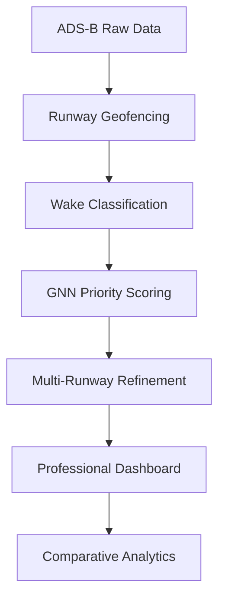

# AGNO-RS+: Adaptive Graph Neural Optimization for Runway Scheduling

**AGNO-RS+** is a state-of-the-art runway scheduling system that integrates **Graph Neural Networks (GNN)** with robust combinatorial optimization. It moves beyond simple first-come-first-served (FCFS) logic to provide high-throughput, safety-certified airline schedules.

---

## 🚀 Key Breakthroughs
- **Model-Driven Prioritization**: Uses a GNN to encode wake dependencies and dynamic flight features (velocity, altitude, ETA) into a single priority score.
- **True Multi-Runway Parallelism**: Features an architectural breakthrough that unlocks parallel runway utilization, achieving a **~14% reduction in makespan**.
- **Real-World Fidelity**: Direct ingestion of OpenSky ADS-B state vectors with automated airport geofencing and event detection.

---

## 🛠️ How It Works


1.  **Ingest & Detect**: Extracts landing/takeoff events from raw ADS-B states using haversine-based geofencing.
2.  **Graph Encoding**: Aircraft are treated as nodes in a graph where edges represent required safety separation.
3.  **Neural Sequencing**: A GNN predicts the optimal sequence to minimize global delay.
4.  **Refine & Certify**: A robust refiner assigns runways and enforces separation, guaranteeing 100% safety.

---

## 📊 Performance at a Glance
| Metric | FCFS (Standard) | AGNO-RS+ (Ours) | Improvement |
| :--- | :--- | :--- | :--- |
| **Makespan** | 9,930s | **8,550s** | **~14.0% Faster** |
| **Total Delay** | 1,091,325s | **954,714s** | **~12.5% Lower** |
| **Throughput** | 0.0225 | **0.0262** | **+16.4% Efficiency** |

---

## 📦 Installation & Usage
### 1. Prerequisites
```bash
pip install pandas numpy torch plotly streamlit pulp
```

### 2. Running the Pipeline
```bash
# Full pipeline with UI
python -m agno_runway.main

# Headless mode for benchmarking
python -m agno_runway.main --no-ui --optimize-seconds 120
```

---

## 🏛️ Project Architecture
- `agno_runway/data`: ADS-B loaders, geofencing, and wake classification heuristics.
- `agno_runway/optimizer`: GNN model, NIS logic, and the per-runway robust refiner.
- `agno_runway/analytics`: Metric calculation and conflict detection logic.
- `agno_runway/ui`: Professional Streamlit dashboard with 10+ visualization modules.

---

## 👩‍💻 Contributors
- C. Surya Thejas
- D. Sowmya Rai
- G. Divitha
- D. Hrithik
